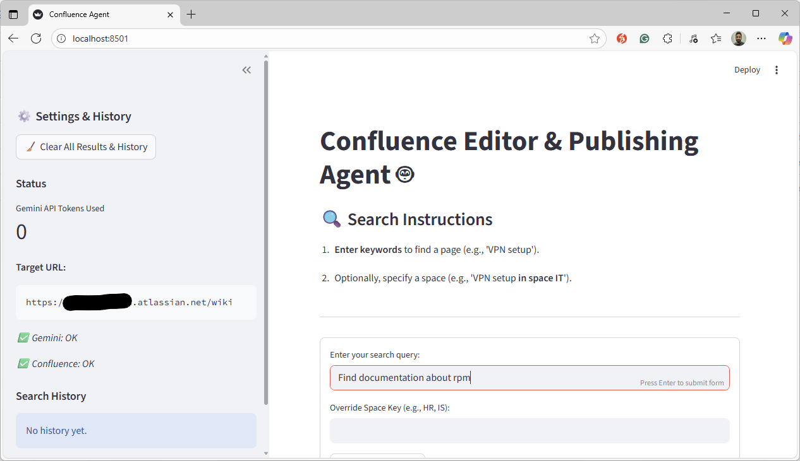
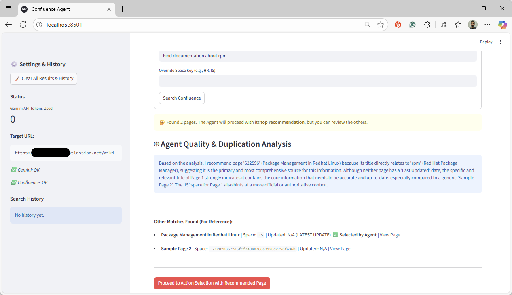
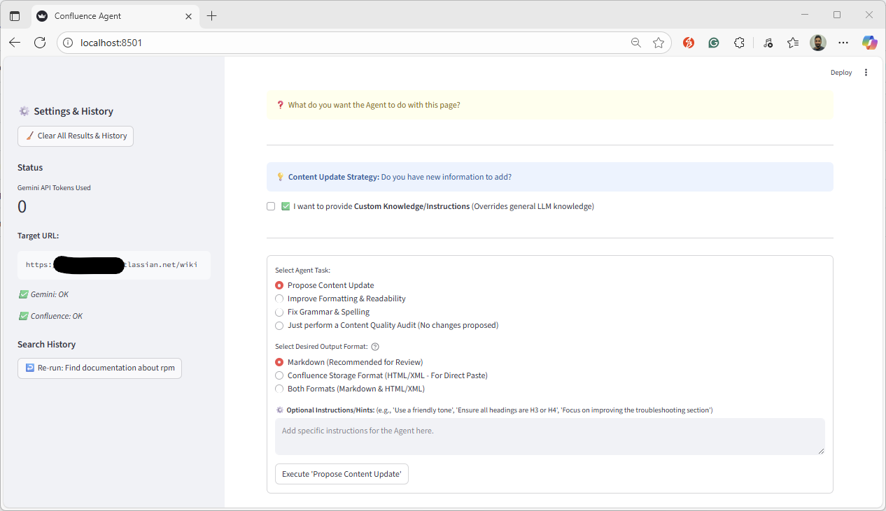
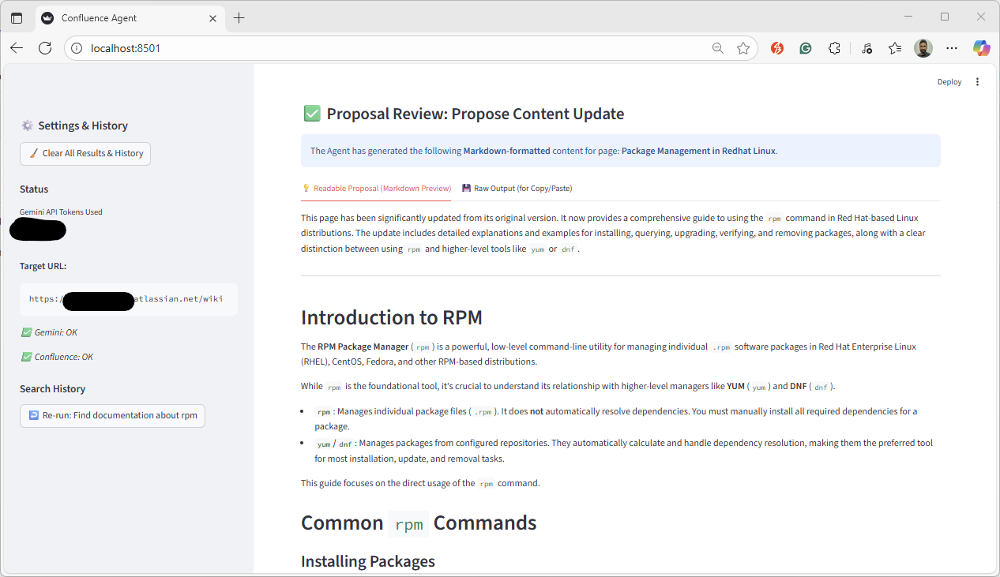

# 🛡️ # platform-engineering-confleunce-helper-agent

A lightweight **Streamlit chatbot agent** powered by **Google Gemini API**, designed for **Platform Engineers** to quickly inspect Confluence pages, check page updates, and run lightweight content health checks.

## ℹ️ About this prototype

This repository is an experimental prototype to explore agentic AI patterns and how small, focused agents can be composed to solve Platform Engineering tasks around Confluence content. It demonstrates:

- How an agent can plan multi-step checks, call external tools (Confluence helper script, Gemini), and synthesize results for a human-friendly chat interface.
- A Streamlit-based UI to interact with the agent, visualize usage, and inspect raw API outputs.
- Safe, read-only workflows intended for investigation and demonstration rather than production use.

### Goals
- Validate simple agent workflows: tool selection, step-by-step reasoning, and result aggregation.
- Provide a minimal, extensible codebase you can fork to try new tool connectors or reasoning strategies.
- Help Platform Engineers understand trade-offs (latency, rate limits, observability) when integrating agents into tooling.

### Quick usage notes
- Start the app: `streamlit run streamlit_app.py`
- Ask the agent natural-language questions (examples in the Examples table) — it will call the Confluence helper script and Gemini as needed and summarize findings.
- Check the “raw output” view in the UI to verify the agent’s source data.

### Limitations & safety
- Read-only by design — the agent will not modify Confluence content.
- Results depend on upstream API responses and the configured API keys; always verify critical changes manually.
- This is an experimental demo and not hardened for production security or scale.

### Extending the demo
- Add new tool modules (e.g., Confluence search refiners, attachment inspectors) and register them with the agent router.
- Swap the LLM connector to test different prompt strategies or cost/latency trade-offs.
- Add caching and rate-limit handling for production experiments.

Contributions and experiments are welcome — open a PR or issue with ideas.
---

## 🚀 Core Features

- 🔍 **Page Search & Discovery** – Find pages by keywords and optionally restrict to a space
- 🧠 **Content Analysis & Recommendations** – Recommend which page to update based on recency and quality
- 📄 **Draft Proposals** – Generate grammar fixes, formatting improvements, or full content update proposals
- 📊 **Usage Metrics** – Monitor Gemini token usage in the UI

---

## 🛠️ Tech Stack

| Component            | Purpose                                 |
|----------------------|-----------------------------------------|
| **Streamlit**        | Chat interface and metrics dashboard    |
| **Confluence (REST)**| Source of page and space data           |
| **Python 3.8+**      | Implementation language                 |

---

## ⚙️ Setup

### 1️⃣ Prerequisites
- `pip install -r requirements.txt`
- Gemini API key (required for LLM features)
- Confluence credentials or API token (helper script handles authentication)

### 2️⃣ Environment Variables
```bash
export GEMINI_API_KEY="your-gemini-api-key"
export CONFLUENCE_URL="https://your-confluence-instance"
export CONFLUENCE_USERNAME="your-email@domain.com"
# Optional: depending on your helper script authentication
export CONFLUENCE_TOKEN="your-confluence-api-token"
```

### 3️⃣ Run
```bash
streamlit run streamlit_app.py
```
Then open the provided local URL (default: http://localhost:8501) to launch the dashboard.

---

## 📚 Example Queries

| 🧩 Task                         | 💬 Example Query in Search Box                                     | 🤖 Agent Action            |
|--------------------------------|--------------------------------------------------------------------|---------------------------|
| Find Page by Topic             | “Find documentation about change management in space IS”           | Searches Confluence.      |
| Recommend Best Page to Edit    | “VPN setup” (when multiple pages are found)                        | Analyzes results and recommends the best page to edit. |
| Propose Content Update         | _(After searching and selecting a page)_                           | User selects the "Propose Content Update" task for the chosen page. |
| Audit Page Quality             | _(After searching and selecting a page)_                           | User selects the "Content Quality Audit" task. |
---

## 🔐 Security & Constraints

- Tokens and credentials are handled via environment variables
- The agent is read-only and does not perform writes to Confluence
- Outputs should be validated against the original Confluence content

---

## 👥 Contributors

Yogesh Kumar – Platform Engineering  
Contributions and feedback welcome via Pull Requests.

---

## 📸 Screenshots

| State             | Screenshot                                   |
|-------------------|----------------------------------------------|
| Agent Ready       |         |
| Agent In Action 1 |  |
| Agent In Action 2 |  |
| Agent Proposal    |   |

---

---

## 📄 License

Licensed under the MIT License.